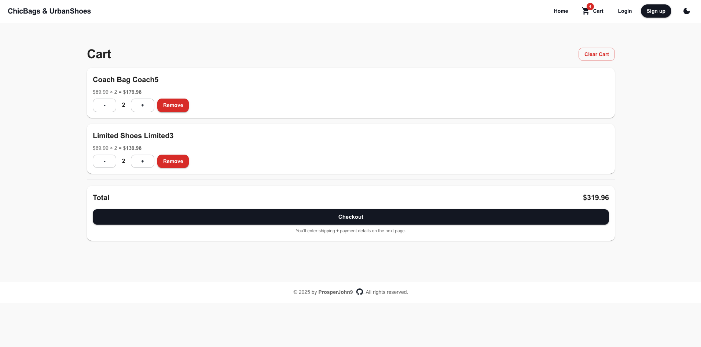
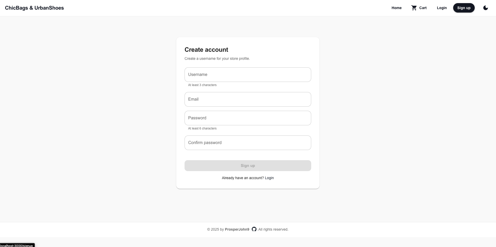

# ChicBags & UrbanShoes 👜👠

A **full-stack e-commerce web application** for a fashion store selling bags and shoes.  
Built with **Spring Boot (Java, PostgreSQL)** on the backend and **React + Material UI** on the frontend.

---
## 🎥 Demo Video

▶️ **Watch the demo here:**  
https://youtu.be/MEGSZVTxtZU

---

## 📸 Screenshots

### Home – Product Grid

### Product Details

### Cart Page

### Checkout

### Order Confirmation

### Sign Up

### Log In

### Dark Mode

### Mobile View

### Orders Page


---

## 🚀 Tech Stack

### Backend
- Java 21
- Spring Boot 3
- Spring Data JPA
- PostgreSQL
- Maven
- Python

### Frontend
- React
- Material UI (MUI)
- React Router
- Axios
- Context API

---

## 📂 Project Structure

```
Ecommerce_2025/
├── SourceCode/
│   ├── backend/        # Spring Boot application
│   ├── frontend/       # React application
│   └── database/       # SQL schema & data
└── README.md
```

---

## 🔌 API Endpoints

### Products
| Method | Endpoint | Description |
|------|---------|------------|
| GET | `/api/products` | Get all products |
| GET | `/api/products/{id}` | Get product by ID |
| GET | `/api/products?category=BAG` | Filter by category |
| GET | `/api/products?brand=Hermes` | Filter by brand |

---

## 🛒 Features Checklist

### Core Features
- ✔ Product listing (bags & shoes)
- ✔ Product details page
- ✔ Category filtering
- ✔ Brand filtering
- ✔ Responsive design

### Cart
- ✔ Client-side cart (React Context)
- ✔ Add / remove items
- ✔ Quantity management
- ✔ Cart total calculation

### Authentication (Frontend)
- ✔ Sign up page
- ✔ Login page
- ✔ Fake auth with localStorage
- ✔ Username displayed in Navbar
- ✔ Protected checkout route

### Checkout & Orders
- ✔ Checkout page
- ✔ Shipping form validation
- ✔ Payment selection (UI only)
- ✔ Order confirmation modal
- ✔ Order history (localStorage)
- ✔ Orders page per user

### UI / UX
- ✔ Material UI theme
- ✔ Light / Dark mode toggle
- ✔ Hover animations
- ✔ Skeleton loading
- ✔ Confetti micro-animation

---

## ▶ How to Run the Project

### 1️⃣ Backend (Spring Boot)

```bash
cd SourceCode/backend
./mvnw spring-boot:run
```

Backend runs on:
```
http://localhost:8080
```

---

### 2️⃣ Frontend (React)

```bash
cd SourceCode/frontend
npm install
npm start
```

Frontend runs on:
```
http://localhost:3000
```

---

## 🗄 Database

- Database: **PostgreSQL**
- DB Name: `ecommdb`
- SQL files located in:
```
SourceCode/database/
```

Spring Boot auto-loads `data.sql` on startup.

---

## 🎓 Academic Notes

This project was developed as part of a teaching exercise to demonstrate:
- Full-stack development
- REST API design
- Database integration
- Modern UI/UX principles

---

## 👤 Author

**Prosper Osaigbovo**  

---

## 📜 License

This project is for **educational purposes only**.
