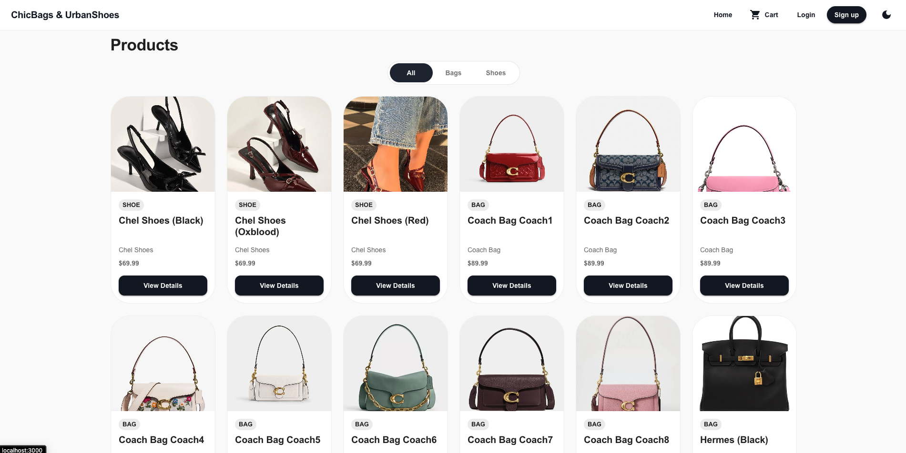
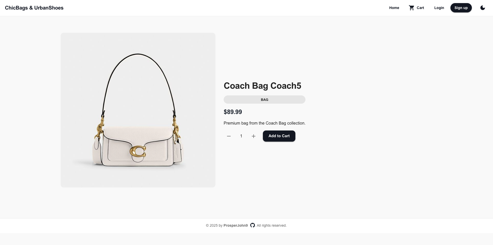
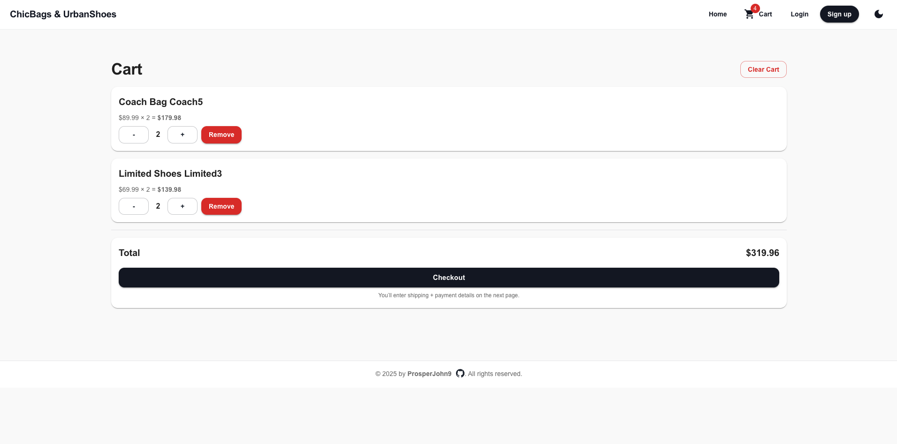
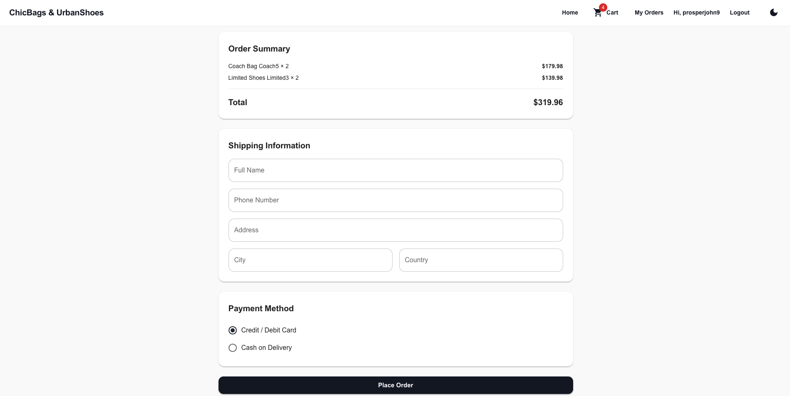
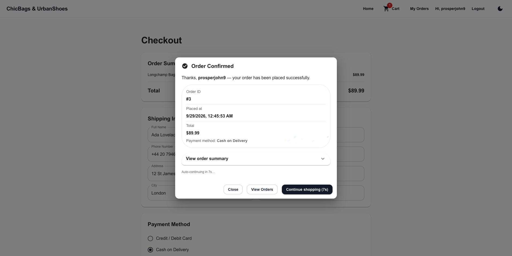
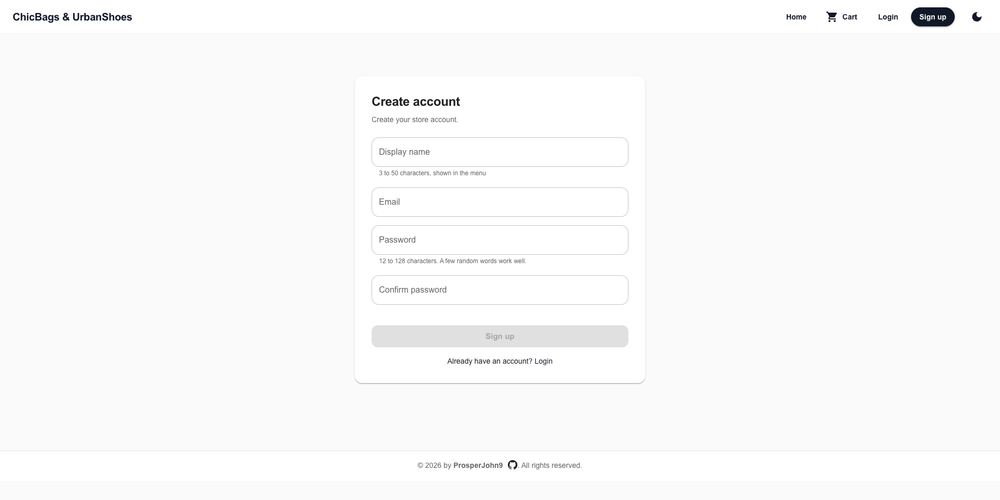
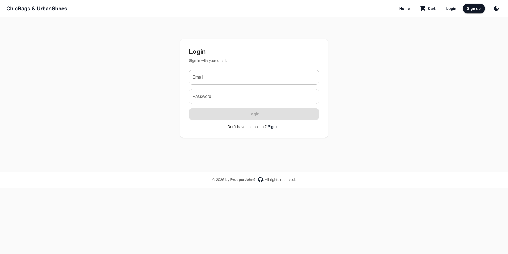
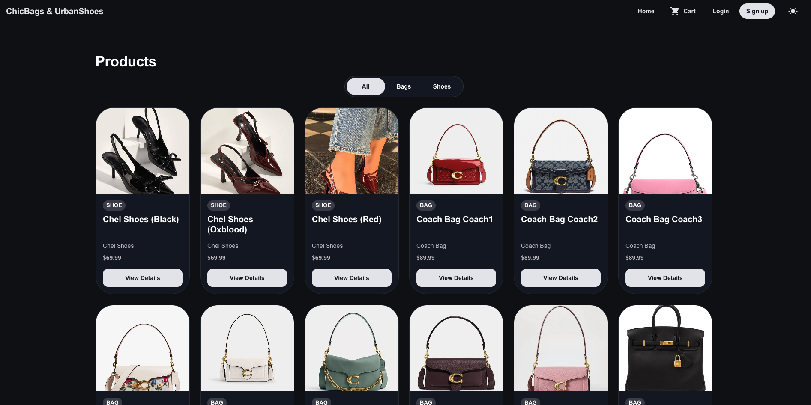
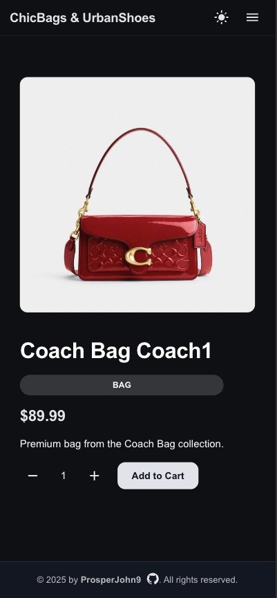
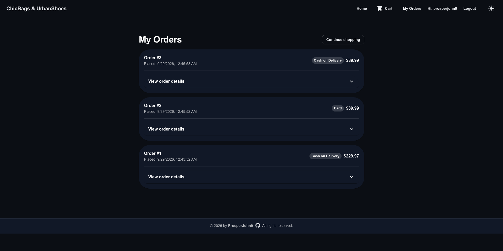

# ChicBags & UrbanShoes 👜👠

A **full-stack e-commerce web application** for a fashion store selling bags and shoes.
Built with **Spring Boot (Java 21, PostgreSQL)** on the backend and **React + Material UI** on the frontend.
Accounts, sessions and orders live on the server; the browser never stores a password or an order total it could fake.

---

## 🎥 Demo Video

[](https://youtu.be/MEGSZVTxtZU)

The video was recorded before the September 2026 security update. The screens and flows are the same, but sign-in now uses your email and runs on the server.

---

## 📸 Screenshots

### Home – Product Grid

### Product Details

### Cart Page

### Checkout

### Order Confirmation

### Sign Up

### Log In

### Dark Mode

### Mobile View

### Orders Page


---

## 🚀 Tech Stack

### Backend
- Java 21, Spring Boot 3.5, Maven
- Spring Security 6.5 (session login, CSRF, CORS)
- Spring Data JPA (Hibernate 6) + PostgreSQL
- Flyway (schema migrations and product seed)
- Bean Validation
- Tests: JUnit 5, MockMvc, H2 in PostgreSQL mode

### Frontend
- React 19
- Material UI (MUI) 7
- React Router 7
- Axios
- Context API
- Tests: Jest + React Testing Library

### Tooling
- Python script that generated the product seed from the image folders

---

## 📂 Project Structure

```
ecommerce2025/
├── SourceCode/
│   ├── backend/                          # Spring Boot API
│   │   ├── .env.example                  # settings to copy into .env
│   │   └── src/main/resources/db/migration/
│   │                                     # Flyway: tables + 76 seed products
│   ├── frontend/                         # React application
│   └── database/                         # old standalone SQL dump, not used by the app
├── generate_products_from_images.py      # wrote the product seed (V2 migration)
└── README.md
```

---

## 🔌 API Endpoints

| Method | Endpoint | Access | Description |
|--------|----------|--------|-------------|
| GET | `/api/products` | public | All products |
| GET | `/api/products?category=BAG` | public | Filter by category (`BAG` or `SHOE`) |
| GET | `/api/products/{id}` | public | One product |
| GET | `/api/auth/csrf` | public | CSRF token and the header to send it in |
| POST | `/api/auth/register` | public, CSRF | Create an account and sign in |
| POST | `/api/auth/login` | public, CSRF | Sign in with email and password |
| POST | `/api/auth/logout` | CSRF | Sign out |
| GET | `/api/auth/me` | signed in | The current user |
| POST | `/api/orders` | signed in, CSRF | Place an order (product ids and quantities only) |
| GET | `/api/orders` | signed in | Your orders, newest first |

---

## 🛒 Features Checklist

### Catalogue
- ✔ Product listing (bags & shoes)
- ✔ Product details page
- ✔ Category filtering
- ✔ Responsive design

### Cart
- ✔ Client-side cart (React Context, kept in memory: a page reload empties it)
- ✔ Add / remove items
- ✔ Quantity management
- ✔ Cart total preview (the server computes the real total at checkout)

### Accounts
- ✔ Sign up and log in with email and password
- ✔ Server-side sessions in an HttpOnly cookie
- ✔ Log out ends the session on the server
- ✔ Display name shown in the navbar
- ✔ Checkout and Orders pages require sign-in

### Checkout & Orders
- ✔ Checkout page with shipping form validation (browser and server)
- ✔ Orders stored in PostgreSQL, priced from the database
- ✔ Order confirmation with the server's order number and total
- ✔ Order history per user, read from the API
- ✔ Payment method recorded (Card or Cash on Delivery). **No payment is processed: this is a demo store.**

### UI / UX
- ✔ Material UI theme
- ✔ Light / Dark mode toggle
- ✔ Hover animations
- ✔ Skeleton loading
- ✔ Confetti micro-animation

---

## 🔐 Security

What protects what, and where to find it.

**Passwords**
- Hashed with **Argon2id** at the OWASP minimum (19 MiB memory, 2 iterations, parallelism 1) with a random salt per password. Stored as `{argon2}$argon2id$...` behind Spring's `DelegatingPasswordEncoder`, so the algorithm can be upgraded later. See `config/SecurityConfig.java`.
- Rule: 12 to 128 characters, no composition rules (NIST SP 800-63B style).
- Passwords are never logged, echoed in error messages, or stored in the browser. On first load the frontend deletes the account and order data that older versions of this app kept in `localStorage`.

**Sessions and cookies**
- The session lives on the server. The browser holds only the `JSESSIONID` cookie: `HttpOnly`, `Secure`, `SameSite=Lax`, 30-minute timeout, never put in URLs.
- Signing in gives the session a new id (blocks session fixation). Logging out destroys the session on the server and expires the cookie.

**CSRF**
- Every POST, including login and register, must carry a CSRF token in the `X-CSRF-TOKEN` header. The token is kept in the server session and handed out by `GET /api/auth/csrf`, which CORS limits to the frontend's origin. It is replaced at sign-in.

**CORS**
- Only the origin(s) in `FRONTEND_ORIGIN` may call the API with cookies, and only with GET and POST.

**Login**
- Unknown email and wrong password get the same `401 Invalid email or password.` For an unknown email the server still hashes a dummy password, so response times match too.
- Rate limit: 5 failed attempts for one email, or 20 from one IP, within 15 minutes return `429` with `Retry-After`. Unknown emails are counted the same way.

**Orders**
- The owner of an order is always the signed-in user from the session. `GET /api/orders` returns only the caller's orders.
- The client sends product ids and quantities only. Prices, line totals and the order total come from the `product` table. A request that includes `price`, `total`, `userId` or any other unknown field is rejected with `400`.
- Quantities must be 1 to 99; the database enforces this and other rules with CHECK constraints.

**Input and output**
- Bean Validation on every request body. Error responses name the invalid field but never repeat the value sent.
- Spring Security's default headers: `X-Content-Type-Options: nosniff`, `X-Frame-Options: DENY`, `Cache-Control: no-store`.
- Anything not listed as public requires a signed-in user (default deny).

**Configuration**
- All database and CORS settings come from environment variables. The app refuses to start, with a message naming the variable, if one is missing.
- SQL logging is off by default. The `dev` profile logs statements only; bound values are never logged.

**Tests** (`SourceCode/backend/src/test`, 56 tests; `SourceCode/frontend/src`, 3 tests) cover register, login, logout, `/me`, Argon2id hashing, identical answers for unknown email and wrong password, session id and CSRF token rotation, CSRF rejection, cookie flags over real HTTP, the rate limit, CORS, security headers, price tampering, order ownership between two users, and the navbar's signed-in states.

### Known limitations

- **Registration reveals whether an email is taken** (`409`). Closing this needs email verification, which this project does not have.
- **The rate limiter is in memory.** It resets on restart and is not shared between instances. It uses the connection's IP address: behind a reverse proxy, configure trusted forwarded headers first, or every user shares the proxy's IP.
- **Per-account lockout can be abused**: five wrong passwords block sign-in for that email for 15 minutes.
- No email verification, password reset or multi-factor authentication.
- Stock is shown but not checked or reduced when ordering.
- Local development runs over plain HTTP. The `Secure` cookie works there because browsers treat `localhost` as secure. A real deployment needs HTTPS.

### Old development password in git history

Until September 2026, `application.properties` contained a local development database password. It was removed from the code and the app now reads all credentials from the environment. It is still visible in git history, which was not rewritten. **If any database you run used that password, change it.**

---

## ▶ How to Run the Project

You need Java 21 or newer, Node.js 18 or newer, and PostgreSQL 14 or newer.

### 1️⃣ Database

```bash
createdb ecommdb
```

On first start, Flyway creates the tables and loads the 76 products. Nothing else to import.

> Upgrading an older local copy? Earlier versions let Hibernate create the `product` table, and Flyway refuses to take over a database like that. Drop and recreate `ecommdb` once (it only held seed products).

### 2️⃣ Backend (Spring Boot)

```bash
cd SourceCode/backend
cp .env.example .env      # then fill in DB_PASSWORD and check the other values
./mvnw spring-boot:run
```

Backend runs on:
```
http://localhost:8080
```

| Variable | Required | Example | Purpose |
|----------|----------|---------|---------|
| `DB_URL` | yes | `jdbc:postgresql://localhost:5432/ecommdb` | Database connection |
| `DB_USERNAME` | yes | `postgres` | Database user |
| `DB_PASSWORD` | yes | | Database password |
| `FRONTEND_ORIGIN` | yes | `http://localhost:3000` | Origin(s) allowed to call the API, comma-separated |
| `COOKIE_SECURE` | no | `true` | Set to `false` only for local HTTP in a browser that drops `Secure` cookies on `localhost` |
| `SPRING_PROFILES_ACTIVE` | no | `dev` | Logs SQL statements (never the values) |

Values can be set as real environment variables or in `SourceCode/backend/.env` (gitignored). Real environment variables win.

### 3️⃣ Frontend (React)

```bash
cd SourceCode/frontend
npm install
npm start
```

Frontend runs on:
```
http://localhost:3000
```

If it starts on another port, add that origin to `FRONTEND_ORIGIN` and restart the backend.

### 4️⃣ Tests

```bash
cd SourceCode/backend
./mvnw test
```

Runs against an in-memory H2 database in PostgreSQL mode: no database or `.env` needed.

```bash
cd SourceCode/frontend
CI=true npm test -- --watchAll=false
```

---

## 🗄 Database

- Database: **PostgreSQL**
- DB Name: `ecommdb`
- Schema and seed data: Flyway migrations in `SourceCode/backend/src/main/resources/db/migration/`
  - `V1` product table, `V2` product seed, `V3` users, `V4` orders and order items
- Hibernate only validates the schema; it never changes it.

---

## 🎓 Academic Notes

This project was developed as part of a teaching exercise to demonstrate:
- Full-stack development
- REST API design
- Database integration
- Modern UI/UX principles

It was later hardened to show secure defaults: server-side authentication, CSRF protection, ownership checks and server-side pricing.

---

## 👤 Author

**Prosper Osaigbovo**

---

## 📜 License

This project is for **educational purposes only**.
